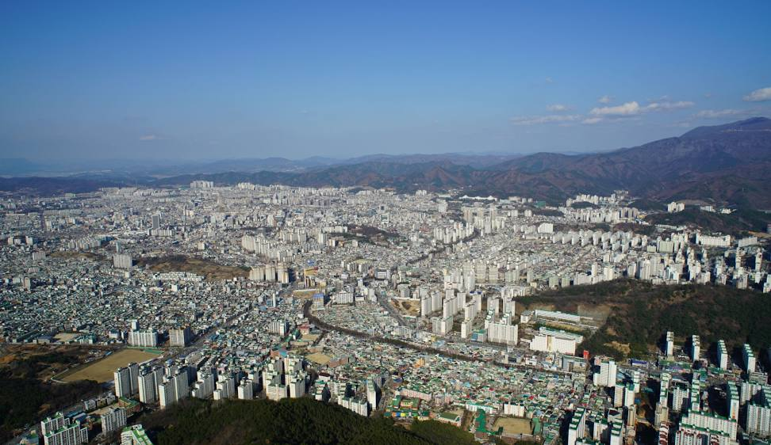

# 00 - Tested Environment Snapshot (공통 실행/테스트 환경 스냅샷)

> 목적  
> 이 문서는 `Handover/` 문서들이 **어떤 환경에서 실제로 실행/검증되었는지**를 고정(스냅샷)으로 남깁니다.  
> 이후 문서(`X0`, `X1~X8`, `X9`)는 기본적으로 이 스냅샷을 전제로 합니다.

- 작성자: 송인용
- 최종 업데이트: YYYY-MM-DD
- 마지막 검증일(실행 확인): YYYY-MM-DD
- 검증 범위: 로보틱스(UGV) 시뮬레이션 + ROS2 연동 + sim-to-real

---

## 0) 빠른 결론 (TL;DR)

- 이 인수인계는 **(1) Real Husky**, **(2) Isaac Sim 기반 Sim Husky**, **(3) Sim-to-Real 전환 예시**를 재현/검증하는 데 초점을 둔다.
- 개발 환경은 **Apple Silicon(macOS arm64)** 기준으로 정리하되, ROS2/Isaac Sim은 **Docker 또는 별도 런타임**에 의존할 수 있다.
- 문서 이미지/스크린샷은 `Handover/assets/<문서명>/` 아래에 저장하며, Markdown 링크는 **상대경로**로 유지한다.

---

