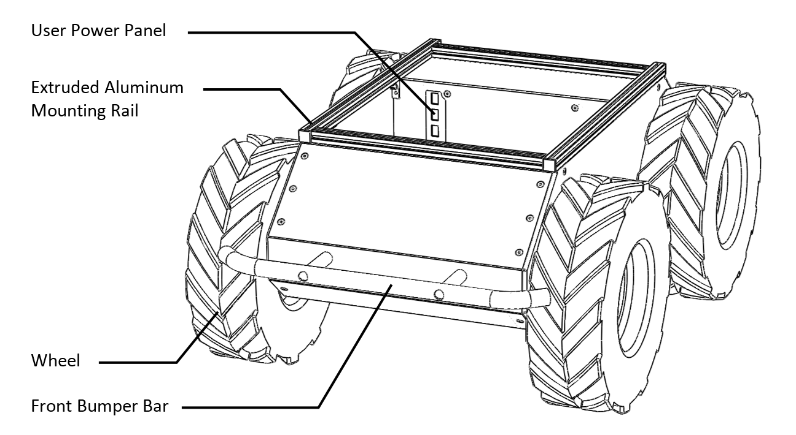
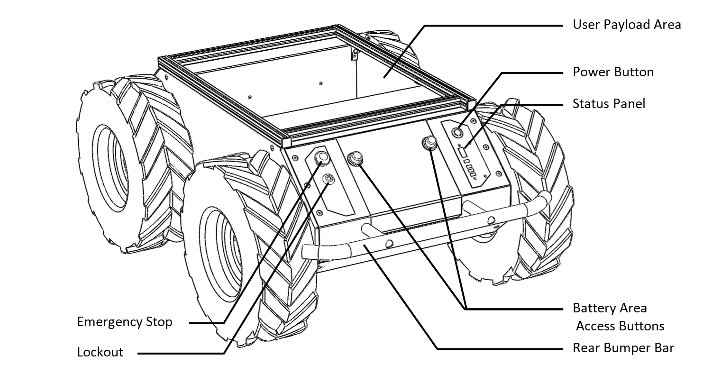
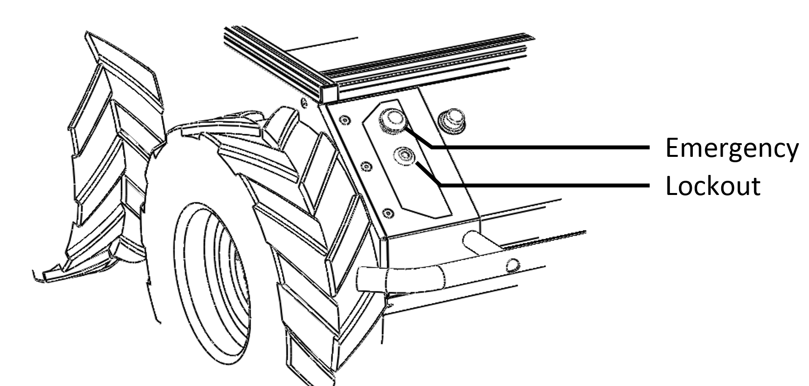

## 11. Clearpath Husky Robot 소개 (공식 페이지 자료 부록)

본 절은 **Husky A200 User Manual**의 핵심 내용을 기반으로, Husky 플랫폼을 이해하기 위한 “공식 기준 정보”를 요약합니다.  
(실제 연구실 운용 환경/접속/명령어는 12~14에서 다룹니다.)

https://docs.clearpathrobotics.com/docs_robots/outdoor_robots/husky/a200/user_manual_husky/

*연구실내 직접 촬영한 사진 제외하면 모두 공식 메뉴얼상에 있는 스크린샷 가져옴

---

### 11.1 개요(Introduction)
- Husky는 **견고하고 사용이 쉬운 무인 지상 로봇(UGV)**로, **신속한 프로토타이핑 및 연구용**으로 설계됨.
- 경고: 모바일 로봇은 본질적으로 위험 요소가 있으며, **운용자는 접촉 가능 인원 교육, 위험요소 이해, 안전장치/완화책 마련** 책임이 있음. (상세는 Safety 섹션 참조)

---

### 11.2 구성품(Shipment Contents)
출고 구성에는 다음이 포함됨:
- Clearpath Robotics Husky 본체
- 24V Sealed Lead-Acid 배터리 팩
- 배터리 도어 커버
- 배터리 충전기
- Lockout 키 2개
- 전원 커넥터 3개
- (옵션) 표준 페이로드 모듈 또는 커스텀 통합 서비스 구매 시 추가 장비/문서 포함

#### 11.2.1 연구실 실물 사진 기록
아래 표는 연구실에서 실제 보유 중인 구성품들 기록용 
문서의 사진들은 모두 26.01.22 기준으로 촬영함

| 구성품 | 보유 여부 | 사진 | 보관 위치/상태 메모 |
|---|---|---|---|
| Husky 본체 | o |  | S7 MobileX Studio |
| 24V 배터리 팩 | o |  | S7 MobileX Studio  |
| 배터리 도어 커버 | o  |  | S7 MobileX Studio  |
| 배터리 충전기 (전원 커넥터 포함) | o |  | S7 MobileX Studio  |
| Lockout 키 | o  |  | S7 MobileX Studio  |

---

### 11.3 하드웨어 개요(Hardware Overview)

#### 11.3.1 시스템 아키텍처(System Architecture)
- Husky는 **Ubuntu가 구동되는 컴퓨터(인텔 기반 또는 Jetson 개발 키트)** + **32-bit MCU** 조합으로 구성됨.
- MCU 역할: **전원 공급 모니터링**, **모터 제어**
- MCU ↔ 컴퓨터 간 통신: **시리얼(serial) 연결**

#### 11.3.2 외형 주요 구성(Exterior Features)
Husky 외형의 주요 요소:
- 알루미늄 마운팅 레일(상단)
- 사용자 페이로드 영역(User payload area) + 사용자 전원 패널(User power panel)
- 전/후 범퍼 바
- 배터리 베이
- 상태 패널(Status panel)
- 전원 버튼(Power button)
- Motion Stop 버튼 및 Lockout

| Husky exterior, front view | Husky exterior, rear view |
|---|---|
|  |  |

---

### 11.4 상태 패널(Status Panel) LED 의미
후면 섀시의 LED 인디케이터가 현재 상태를 요약 표시함.

| 아이콘/항목 | 의미 |
|---|---|
| Battery Status | 4개 LED 세그먼트로 배터리 잔량을 대략적으로 표시 |
| Communication Status | Green: 정상 형식의 모션 명령 스트림 수신, 주행 준비 / Yellow: 명령 수신 중이나 E-stop 또는 오류로 주행 불가 / Red: 시리얼 통신 타임아웃 |
| General Error Status | 오류 상태로 주행 불가일 때 Red 점등(예: E-stop, 배터리 부족, 소프트웨어 오류 등) |
| Emergency Stop Status | E-stop 활성화로 주행 불가일 때 Red 점등(온보드 또는 무선 E-stop 포함 가능) |
| Charge Indicator | 외부로부터 사용자 전원이 공급될 때 Red 점등 |

---

### 11.5 버튼 및 Lockout(Buttons and Lockouts)

#### 11.5.1 전원 버튼(Power button)
- 상태 패널 상단의 실버 버튼으로 전원 On/Off
- Off 상태에서 누르면 전원 On, 버튼 외곽 파란 링 점등
- On 상태에서 누르면 전원 Off, 파란 링 소등

#### 11.5.2 Stop 버튼 / Lockout

- 핵심 경고: **Stop 버튼은 항상 접근 가능해야 하며**, 후면을 가려 접근을 방해하는 페이로드 장착을 피해야 함
  -> 해당 기능은 로봇 주행시 사고가 날 위험이 있을때 눌러 움직임을 긴급 정지할 수 있음
- Lockout은 **로봇이 전원은 켜지지만 모터 구동은 불가**하도록 “움직임 봉인”하는 수단
  -> 연구실 실제 사례로, 가끔 열쇠를 잠궈놓고 로봇이 동작안된다고 할때가 있음, 한번 실사용시 체크 ; 또한 센서 데이터 뽑기만 할때는 배터리를 절약할 수 있어 잠그는게 유용할때가 있음

| Stop button and Lockout | 실제 사진 |
|---|---|
|  |  |

---

### 11.6 페이로드(Payloads) 확장성
- IMU, LiDAR, 카메라, GPS, 매니퓰레이터 등 다양한 페이로드 통합 가능
- 지원 패키지/문서: 문서 포털의 Computers / Sensors / Manipulators / Accessories 섹션 참고
- Clearpath 페이로드 키트는 일반적으로 **전용 브라켓 + 케이블링** 포함

- !연구실내 Husky A200 의경우 추가적인 브라켓과 그 위에 Ouster 사의 Lidar가 추가로 장착됨

---

### 11.7 좌표계/방향 기준(Orientation References)
- Clearpath 지상 로봇의 기준 프레임은 **ISO 8855 기반**
- Husky 정면 기준, **양의 병진 속도(전진)**는 바퀴가 **+X 방향**으로 이동
- 항공(roll/pitch/yaw) 좌표계와 축 해석이 다를 수 있으니 **데이터 해석 시 주의** 필요

---

### 11.8 로봇 운동학 기본식(Robot Equations)
Clearpath 권장(차동 구동 기반) 관계식:

- 병진 속도  
  `v = (v_r + v_l) / 2`

- 회전 속도  
  `ω = (v_r - v_l) / W`

정의:
- `v`: 플랫폼 병진 속도
- `ω`: 플랫폼 회전 속도
- `v_r`, `v_l`: 우/좌측 바퀴 속도
- `W`: 유효 트랙 폭(effective track), **0.555 m**

---

### 11.9 주요 사양(System Specifications) 요약
- 크기(Length/Width/Height): 990 / 670 / 390 mm
- 무게: 50 kg
- 최대 페이로드: 75 kg (조건부 표기 포함)
- 최대 속도: 1 m/s
- 등판/횡경사: 45° / 30°
- 동작 온도: -10°C ~ 40°C (직사광선 제외)
- 평균 운용 시간: 3시간 (대기 8시간)
- 배터리: 20 Ah @ 24 V, sealed lead-acid
- 충전 시간: 10시간
- 통신: RS-232, 115200 baud
- 휠 엔코더: 78,000 ticks/m
- 내부 센싱: 배터리 상태, 휠 오도메트리, 모터 전류
- 방진/방수: IP44(기본) 등 구성에 따라 상이

---

### 11.10 시작하기(Getting Started) 핵심 요약
- 초기 실험은 Safety 섹션 지침대로 로봇을 **“up on blocks”** 상태로 두고 시작(바퀴가 지면에 닿지 않게)
- 대부분 구성에서 **Onboard Computer(로봇에 연결)** + **Offboard Computer(제어/데이터 수집)** 구조이며, 두 컴퓨터는 통신 가능해야 함
- Onboard Computer는 User Bay의 user power panel에서 접근 가능한 **시리얼 포트(DE-9 female)**에 연결
  - straight-through 케이블(Null modem 아님) 강조
  - USB-serial 어댑터 제공
- 현재 연구실내 보유중인 Husky A200 의 모델의 경우에도 Onboard Computer 와 

---

### 11.11 전원 인가/네트워크/컨트롤러(운용 전제 요약)

#### 11.11.1 Powering Up 요약
- 배터리 도어를 열어 배터리 커넥터를 결합 후 도어를 닫음
- 전원 버튼을 누르면 파란 링 점등, 상태 패널 테스트 패턴 표시
- 초기에는 COMM이 Red(컴퓨터가 아직 통신 시작 전)일 수 있음
- Stop 모드 여부에 따라 STOP LED 확인 후, COMM이 Green 또는 Yellow가 되면(부팅 후 60~90초) ROS가 올라와 베이스 통신이 성립됨

#### 11.11.2 Network Configuration 요약
- 로컬 Wi-Fi 연결을 위해서는 먼저 **유선으로 온보드 컴퓨터에 접근**해야 함(상세는 이후 Tutorials)

#### 11.11.3 Controller 사용 요약
- 컨트롤러는 Husky와 페어링되어 있고 전원이 켜져 있어야 함
- teleop는 motion stop 해제 후 enable 버튼(슬로/패스트)을 누르고 조작

-> 뒤에 세션에서 다시 설명하지만 현재(26.01.22) 기준 ROS2 버전은 무선 컨트롤러 연동 기능을 추가안해두고 현재 네트워크 기반 원격 조종 기능만 남아 있음

---

### 11.12 배터리 충전(Battery Charging) 요약
- 배터리는 로봇 외부 또는 로봇 내부 장착 상태에서 충전 가능
- 장착 상태 충전 시 배터리 영역 접근 후 MCU 보드에서 배터리 분리 필요
- 충전 절차 개요:
  1) 충전기 DC 케이블을 배터리 단자에 연결  
  2) AC 전원 연결 → 충전기 LED Red  
  3) 완충 시 LED Green  
  4) AC 분리 후 배터리 단자 분리
- 충전기는 기본적으로 2-state 충전(초기 고전류 → 27.2V 정전압 topping)

-> 배터리 수명을 위해 평소에 상시로 배터리에 충전기를 충전하고 있어야함 (공식 메뉴얼 주의 사항임) ; 또한 23년도부터 구동한 장비라 26년도 시점에서는 배터리 수명이 많이 줄어든 상태 감안

---

### 11.13 Safety 핵심 요약(필수 준수)
- 저속부터 시작(0.1 m/s 수준도 정확히 유지 가능)
- 바퀴 주변 끼임 위험 구간 주의(바퀴-범퍼 바 사이)
- Stop 버튼 접근성 확보(후면을 가리는 페이로드 금지)
- Stop은 비상 상황용이며 정규 운용 제어 수단으로 사용하지 말 것
- Stop 모드에서 명령은 버퍼링되지 않고 “최신 명령”만 유효하므로, Stop 해제 시 즉시 움직일 수 있음
- 전기 안전: 배터리/퓨즈 패널/커넥터 임의 변경 금지, 배터리 도어 미장착 운용 금지, 지정 충전기 사용 등
- 운반/이송: 2인 운반 권장, 짧은 이동은 Stop 모드, 장거리 이동은 전원 Off 권장, 밀어서 이동 금지
- 상태 모니터링 권장: `/status`, `/diagnostics`로 전압/전류/온도/상태 확인(장시간 운용 시 특히 중요)
