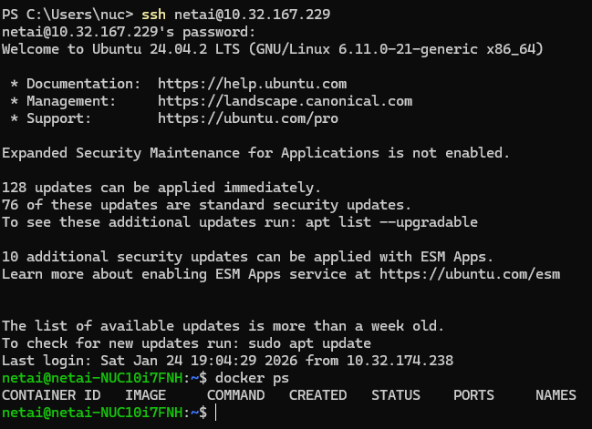
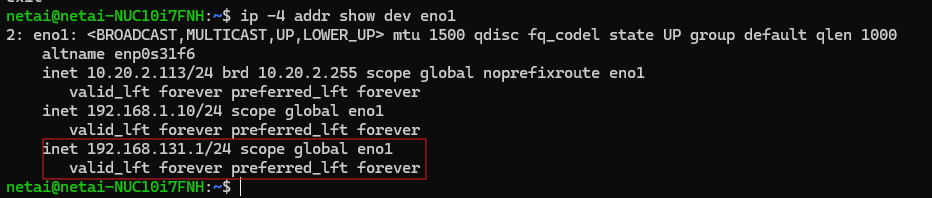
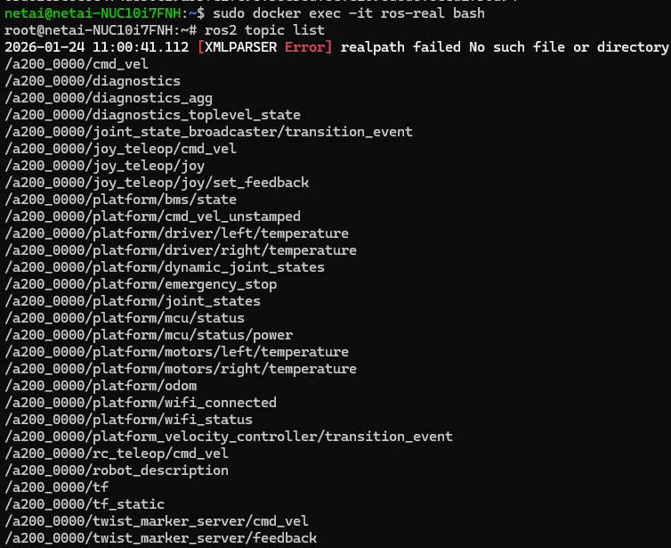

# 13 - ROS2 세팅 현황 및 원격접속 방법

- 작성자: 송인용  
- 목적: 연구실 Husky A200 운용을 위해 구축된 **ROS2 Humble 기반 실행환경(도커 포함)**의 “현재 세팅 현황”과, 해당 환경에 접속하여 최소 점검을 수행하는 **원격접속 방법**을 정리한다.  
- 범위: ROS2 업그레이드 관련 “현재 세팅 현황” 요약 + 접속 경로/판정/1차 확인 포인트  
- 비고: 상세 설치/재구축 절차는 별도 문서로 분리(추후 작성)

---

## 13.1 ROS2 업그레이드 및 운영 구조 개요(현황 요약)

### 13.1.1 왜 ROS2 별도 환경을 구축했는가
-   Isaac Sim 기반 시뮬레이션 연동을 위해 ROS2 Humble 이상 세팅이 필요했음
- 따라서 기존에 인계받은 ROS1 머신은 그대로 납두고, 대신 새롭게 ROS2 머신을 세팅해 사용하고 있음
- 기존에는 도커 컨테이너 파라미터 하나만 변경하면 가상/현실 로봇 모두 제어하도록 구현되었으나 마지막 업데이트 이후 일부 깨진 부분이 있어, 아래 참고하여 명령어 실행 필요


---

## 13.2 ROS2 세팅 현황(현재 기준으로 “무엇이 있는지”만)

### 13.2.1 ROS2 배포판/실행 방식
- ROS2 배포판: Humble
- 실행 방식: Docker 기반
- 호스트 OS/아키텍처: 우분투 22 이상
- 컨테이너 이름/이미지 이름: 하단의 도커 허브내 주소 및 명령어 참조

### 13.2.2 관련 레포/이미지 위치


- **ROS2 폴더(메인 진입점)**  
  - Repo: `SmartX-Team/Omniverse`  
  - Path: `ROS2/`  
  - Link: https://github.com/SmartX-Team/Omniverse/tree/main/ROS2


- 관련 코드 위치(Repo/폴더):
  - `Omniverse/ROS2/ros2-container/`
    - Universal UGV Control Container (Isaac Sim UGV 및 실제 ClearPath UGV를 동일 컨테이너로 운용)
  - `Omniverse/ROS2/ros2-otf/`
    - On-The-Fly(OTF) 데이터 스트리밍 파이프라인(실제 인프라 배포 코드는 별도 레포 참고)
  - `Omniverse/Extension/[NetAI]GIST_Husky_IsaacSim_ROS/`
    - Isaac Sim 4.5 Husky 로봇 시뮬레이션 Extension 코드

- Docker 이미지 Repo/Registry:
  - 사전 빌드 이미지: `docker.io/ttyy441/ros2-container`
  - 예시 태그 :
    - `0.5.7` (v0.5.x 계열 예시)
    - `0.5.0` (과거 예시)

- 태그/버전 규칙(요약):
  - v0.5.x (Current, August 2025): SLAM & Navigation Integration 등 큰 기능 확장
  - v0.4.x (April 2025): 단일 파라미터로 Isaac Sim / Real Robot 모드 선택(isaac_sim / real_robot) 도입

세부 내용은 각 Repo별 README.md 참고 

### 13.2.3 주의사항 및 제한 사항(중요)
- 신규 머신을 ROS 용으로 추가 장착하는 것은 가능하나, **Husky 배터리 출력으로 구동할 장비는 mini-NUC 시리즈 또는 Jetson 급**을 권장
  고성능 PC를 장착할 경우, **필요 전류(A) 및 소비전력(W)을 사전에 산정**한 뒤 장착하거나 **외부 전원 공급**을 사용
- ROS2 컨테이너는 무선 컨트롤러 미연동되어 있음, 네트워크 기반 원격 조종만 추가되어 있음 필요시 누가 작업좀 해주셈요 (inyong)
- ROS1 NUC 과 다르게 별도 설정 안하면 ROS2 머신은 전원이 들어온다고 당연히 자동부팅 안될 수 있으니 수동으로 NUC PC 전원 버튼도 누르는거 꼭 확인..
- 현재 ouster Lidar 는 처음 인계받은 그대로 IP를 192.168.131.20 로 할당되어 있음 ; 따라서 Lidar 와 Nuc PC에 연결된 랜 포트에 192.168.131.x 를 할당해 줘야함

---

## 13.3 원격접속 방법(접속 경로)

> DHCP 나 환경이 지남에 따라 원격 주소가 변경되어 있을 수 있으니, 새로 작업하는 사람이 한번쯤은 모니터 연결후 직접 할당받은 IP 사용 권장

복원 가능성을 테스트하고자 새로운 NUC mini 머신에 26.01.24 기준 최신 도커 컨테이너인 0.6.0 태그를 사용하여 테스트하였음


### 13.3.1 접속 대상 주요 정보
- NUC-ROS2 (ROS2 Humble Docker 실행 머신)
  - 위치/보관: AI 대학원에 존재하는 mini-nuc 06 버전 사용
  - 네트워크 연결: 무선
  - IP/호스트명: 10.32.167.229 (테스트용 mini nuc이 DHCP 할당로 받은 IP 주소임)

- Husky에 장착되어 있을때는 무선 조종 상황만을 가정함

- SSH 사용 여부: 사용
  - 예시: `ssh netai@10.32.167.229`

---

## 13.4 접속후 ROS2 가동 확인

### 13.4.1 주요 확인 절차 모음
**사용할 머신에 시리얼 케이블 포함 모든 케이블 연결 후 SSH 로그인 성공(프롬프트 진입) 여부 확인** 

아래는 새로운 머신을 세팅한다는 가정하에 절차를 작성해둠 기존에 설정해두거나 systemctl 로 간단하게 자동화 가능한 부분이 많음

|상황 | 예시사진 | 비고 |
|---|---|---|
| mini-nuc에 물리적인 USB 케이블들 장착 예시|  | 사진상에서는 작업하느라 mini-nuc 을 외부 전원케이블과 연결했는데, mini-nuc 시리라면 기존에 Husky에 있는 전원 케이블 사용해도 무방  |
| mini-nuc에 ssh 접속 |   | docker 와 이더넷 ip 정보는 사전에 미리 설치 및 설정하에 설명 진행함 (해당 과정은 LLM 한테 문의하셈..) |
|컨테이너내 랜카드에 ouster Lidar와 통신을 위한 ip 대역 할당되었나 확인 |  | |
| 컨테이너 동작했을시  |  | 정상적인 실행이 되면, ROS1 머신 사용할때처럼 Huskt와 정상적으로 통신 시작 ; USB 케이블들 특히 시리얼 케이블의 경우 전원 키기전에 ROS2 용 머신에 연결되어 있어야함 |
| ros2 상태 확인 |   | 정상적으로 센서 데이터등 생성되나 확인 |


### 13.4.2 Docker/ROS2 기본 상태 확인(최소)
아래는 “최소 실행” 템플릿이고 실제 사용중 필요한 명령어는 새로운 머신이나 작업된 상태에 따라 달라질 수 있음.

**Docker 동작 확인**  
아래 명령으로 실행 중인 컨테이너를 확인합니다.
 
  ```bash
  docker ps
  ```

**컨테이너 이미지 준비**
실제 허스키를 제어할 pc에다가 아래처럼 도커 컨테이너를 가여옵니다.
  ```bash
docker pull docker.io/ttyy441/ros2-container:0.6.0
  ```

**컨테이너 실행**
real_robot 파라미터로 컨테이너를 실행시킨다
컨테이너 내부에 ouster Lidar, Intel Depth camera 드라이버 로드까지 전부 자동화되어 있어 컨테이너가 실행되면 , 곧바로 로봇 제어가 가능해집니다.
! ROS_DOMAIN_ID 는 처음 테스트 단계에서는 0 으로 두는거 추천 

  ```bash
  sudo docker run -it --rm \
  --name ros-real \
  --network host \
  --ipc=host \
  --privileged \
  -e ROS_DOMAIN_ID=0 \
  -e AUTO_LAUNCH=true \
  -e DISPLAY=$DISPLAY \
  -v /tmp/.X11-unix:/tmp/.X11-unix:rw \
  --device=/dev:/dev \
  docker.io/ttyy441/ros2-container:0.6.0 \
  real_robot

  #0.6.0 버전에서는 사용 불가능 아래 명령어로 대체
  ```

!! 0.6.0 기준 컨테이너에 slam 및 nav 기능들을 계속 추가하다보니 현재 real_robot 만으로는 ouster, Depth Camera 정상 인식이 안되는 상황으로 

아래 명령어로 컨테이너 실행 권장 (ouster Lidar 까지 정상 실행, Depth Camera 제외)


```bash
sudo docker run -it --rm \
  --name ros-real \
  --network host \
  --ipc=host \
  --privileged \
  -e ROS_DOMAIN_ID=0 \
  -e AUTO_LAUNCH=false \
  -e DISPLAY=$DISPLAY \
  -v /tmp/.X11-unix:/tmp/.X11-unix:rw \
  --device=/dev:/dev \
  docker.io/ttyy441/ros2-container:0.6.0 \
  real_robot \
  ros2 launch ouster_ros driver.launch.py \
    params_file:=/root/app_ws/install/husky_isaac_bringup/share/husky_isaac_bringup/config/ouster_param.yaml \
    viz:=false
 ```


-