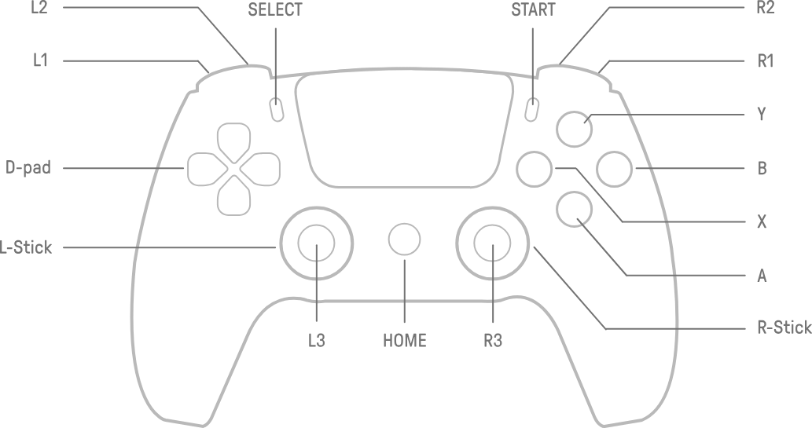

# 14 - ROS2 컨테이너 실행 및 Husky 운용 방법

- 작성자: 송인용
- 작성일: 2026-08-15
- 목적: 13번 문서대로 세팅이 끝난 머신에서, **컨테이너 실행부터 실제 주행/센서 확인/SLAM 세션까지**의 운용 절차를 정리한다.
- 범위: 도커 실행 명령 + PS5 패드 조작 + 정상 가동 검증 + SLAM/Nav2 세션
- 비고: 신규 머신 세팅(고정 IP, sysctl 등)은 13번 문서 참고. 본 문서는 "이미 세팅된 머신" 기준

---

## 14.1 컨테이너 실행

### 14.1.1 이미지 준비
```bash
docker pull docker.io/ttyy441/ros2-container-real:1.1-jazzy
```

### 14.1.2 상시 구동 등록 (권장)
부팅 시 자동 기동 + 크래시 시 재시작. 베이스 + Ouster + RealSense + PS5 텔레옵까지 전부 자동으로 올라옴.
```bash
docker run -d --name husky --restart unless-stopped \
  --network host --ipc=host --privileged \
  -e AUTO_LAUNCH=true \
  --device=/dev:/dev \
  docker.io/ttyy441/ros2-container-real:1.1-jazzy \
  real_robot sleep infinity
```
- ROS_DOMAIN_ID 는 주지 않는다 (Clearpath 가 0 으로 강제함 — 13.2.3 참고)
- 시리얼 케이블(파란 USB-Serial)은 **컨테이너 실행 전에** 연결되어 있어야 함
- 내부 colcon 빌드 때문에 완전 기동까지 **1분~1분 30초** 걸림. `docker logs -f husky` 로 지켜보다가 `Clearpath services started` / `Teleop supervisor started` 뜨면 준비 완료

### 14.1.3 1회성 테스트 실행
```bash
docker run -it --rm \
  --network host --ipc=host --privileged \
  -e AUTO_LAUNCH=true \
  --device=/dev:/dev \
  docker.io/ttyy441/ros2-container-real:1.1-jazzy \
  real_robot
```

### 14.1.4 모드 목록
| 모드 | 용도 |
|---|---|
| `real_robot` (기본) | 베이스 + 센서 + 텔레옵 |
| `sensors_only` | 베이스 없이 Ouster/RealSense 만 점검 |
| `joytest` | 로봇 없이 패드 매핑만 확인 |

### 14.1.5 자주 쓰는 운용 명령
```bash
docker logs -f husky          # 기동 로그 실시간
docker exec -it husky bash    # 컨테이너 진입 (source /opt/ros/jazzy/setup.bash 후 사용)
docker restart husky          # 재시작
docker rm -f husky            # 등록 해제 (run 옵션 바꿔서 다시 등록할 때)
```

---

## 14.2 PS5 DualSense 패드

### 14.2.1 페어링 (신규 패드/머신 1회)

현재 세팅된 NUC 과 0950 조이스틱은 페어링된 상태임
페어링은 GUI 에서 도 가능하니 새로 페어링해야하는 경우는 PS5 DualSense Joystick 페어링 방법 서치해서 수행할 것
```bash

ls /dev/input/js*  # js0(본체), js1(모션센서) 등 실제 console 에 머신이 보이면 성공
```

### 14.2.2 조작법



- **L1 을 누르고 있는 동안만 주행** (데드맨 — 손 떼면 즉시 정지)
- L1 + 왼스틱 상하 = 전/후진 (0.5 m/s)
- L1 + 오른스틱 좌우 = 회전
- L1 + R1 = 터보 (1.0 m/s)

### 14.2.3 패드 관련 알아둘 것
- 패드가 절전으로 끊겼으면 **PS 버튼 한 번**만 누르면 됨 — 컨테이너 내 supervisor 가 장치 재열거를 자동 추적하므로 **컨테이너 재시작 불필요**
- 0815 기준으로 조이스틱으로 Husky Robot 정상 제어하는거 확인함 ; 다만 이전부터 실사용하다보면 문제가 생긴적이 꽤 있으니 이후 트러블 슈팅 할 일이 있다면 스스로 확인 필요
---

## 14.3 Husky 정상 가동 검증

2026-08-15 실기 검증 당시 실제 모든 센서 들이 정상적으로 통신이 되는지 확인하는 명령어들 (Ouster, Depth Camera, JoyStick)
해당 토픽들중 문제가 있다면 통신&제어 과정 트러블슈팅 필요함


```bash
# 베이스: odom TF (frame_id: odom / child: base_link 나와야 함)
docker exec husky bash -c 'source /opt/ros/jazzy/setup.bash && timeout 5 ros2 topic echo /a200_0000/tf --once | grep -A1 frame_id'

# Ouster: scan 10.00 Hz (points ~9.5 Hz, imu 100 Hz)
docker exec husky bash -c 'source /opt/ros/jazzy/setup.bash && timeout 6 ros2 topic hz /ouster/scan'

# RealSense: color/depth 각 30 Hz
docker exec husky bash -c 'source /opt/ros/jazzy/setup.bash && timeout 6 ros2 topic hz /camera/color/image'

# 텔레옵: 스틱 움직이면서 실행 — axes 에 0 아닌 값 나와야 함
docker exec husky bash -c 'source /opt/ros/jazzy/setup.bash && timeout 8 ros2 topic echo /joy --field axes --once'
```

- controller_manager 의 Overrun WARN 이 계속 찍히는 건 pl2303 시리얼 특성으로 **정상임** (13.5 #9)
- 수동으로 cmd_vel 쏴서 테스트할 땐 **TwistStamped** 사용:
```bash

# 해당 명령어 복붙으로 실행하지 하지마셈 실제 Husky Root 움직이는거라 사고날 수 있음
docker exec husky bash -c 'source /opt/ros/jazzy/setup.bash && ros2 topic pub -r 10 /a200_0000/cmd_vel geometry_msgs/msg/TwistStamped "{header: {frame_id: base_link}, twist: {linear: {x: 0.2}}}"'
# Ctrl+C 로 정지. 로봇 굴러가니 주변 확보하고 실행


```

---

## 14.4 SLAM / Nav2 세션

Slam 이나 Nav등도 연구를 편의성을 위해 세팅해서 넣어두었다.
매핑/자율주행이 필요한 세션에만 수동으로 켠다.
(slam_toolbox 가 Jazzy 에서 lifecycle 노드로 바뀌어서 상시 가동보다는 필요로할때 활성화 하는게 깔끔함, 아래 스크립트가 활성화는 알아서 해줌)

다만 해당 기능은 사용할 수 있도록 세팅만 해둔거지 실제로 Slam으로 Map 생성등은 가능한데 디테일한 파라미터 세팅등은 실제 연구용으로 사용하려는 사람들이 직접 만지면서 세팅해봐야함


```bash
docker exec -it husky /root/start_slam_nav.sh                    # SLAM + Nav2
docker exec -it husky /root/start_slam_nav.sh nav_enabled:=false # SLAM 만
# Ctrl+C 로 세션 종료
```

- 지도 토픽: `/a200_0000/map` — 확인:
```bash
docker exec husky bash -c 'source /opt/ros/jazzy/setup.bash && timeout 15 ros2 topic echo /a200_0000/map --once | head -6'
```
- 기동 성공 마커 (로그): `slam_toolbox lifecycle up` → 이후 Nav2 `Managed nodes are active`
- Nav2 목표 지정: RViz2 의 Nav2 Goal (원격 PC에서 도메인 0 맞추고 접속) 또는 `/a200_0000/navigate_to_pose` 액션
- 라이다 마운트 오프셋이 기본값(z=0.5m 추정치)이라 지도가 이상하면 실측 후 컨테이너 run 에 `-e ROS_LIDAR_XYZ_RPY="0 0 <실측높이> 0 0 0"` 추가

---

## 14.5 남은 작업 / 다음 담당자에게
- 라이다 마운트 높이 측정등 재확인 필요 → `ROS_LIDAR_XYZ_RPY` 보정 (지도 품질 직결)
- ROS_DOMAIN_ID 를 연구실 표준으로 통일할지 결정 (현재 0, 바꾸려면 robot.yaml 수정 + 재빌드)
- Ouster 펌웨어 3.x 업그레이드 검토 (올리면 드라이버 핀 해제 가능, 미검증)
